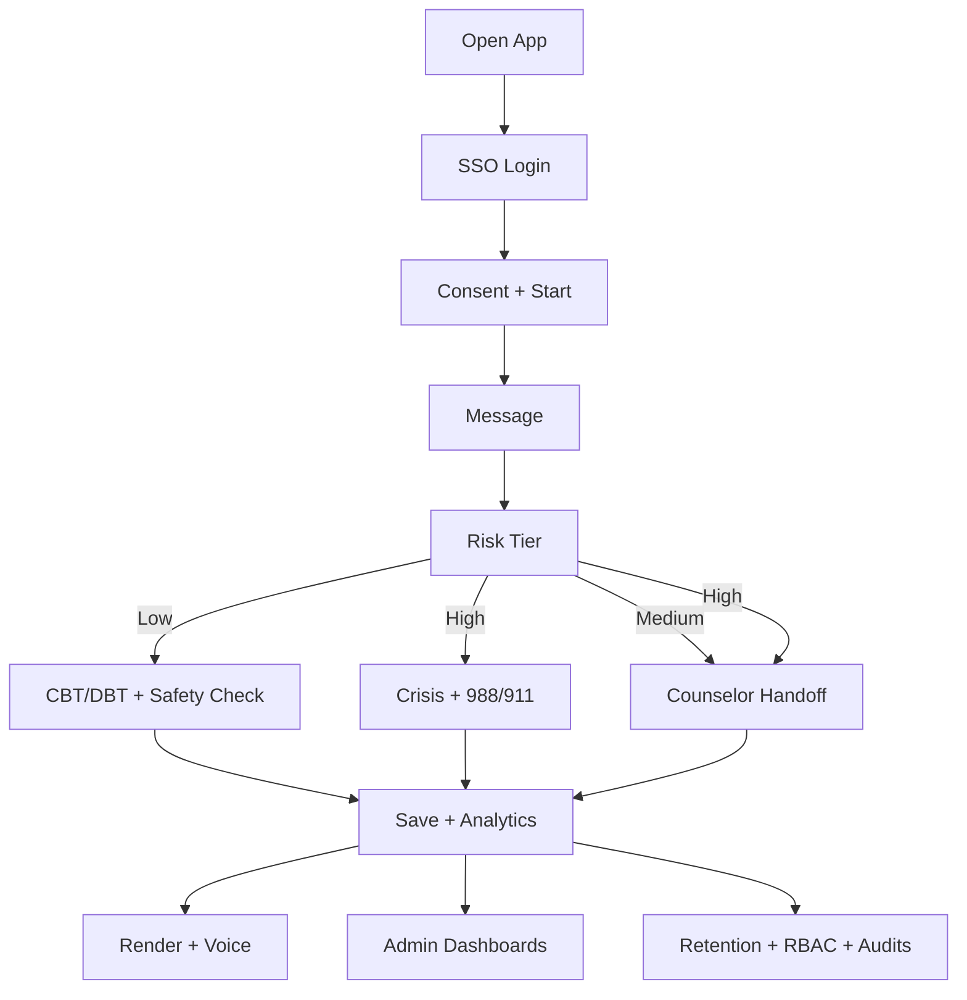

# 🧠 MindScope — Master Judge Playbook (Complete & Defensible)

This playbook is your single source for the full pitch, demo, architecture, safety/privacy, KPIs, monetization, diagrams, and Q&A. Pair it with `SIMPLE_JUDGE_GUIDE.md` for a 3–5 minute version.

---

## 1) One‑line Pitch

MindScope is a web app that gives students instant, safe, multilingual mental‑health support 24/7 and helps colleges act early using real data.

## 2) Three‑Column Summary (Speakable)

- Detailed Explanation: Web/PWA, 15+ languages, 24/7 AI support, CBT/DBT steps, smart triage, dashboards, SSO + SIS/LMS/email integrations.
- Solves the Problem: Always available, handles high volumes, lowers costs, early‑warning signals, private & accessible, fewer mistakes.
- What’s Unique: Evidence‑based flows (not just chat), micro‑lessons with outcomes, seamless counselor handoffs, privacy‑by‑design, measurable ROI.

## 3) Live Demo Script (5–8 minutes)

1. Open AI Therapist → type “I’m stressed about exams.”
   - Show CBT steps + follow‑up question; switch language.
2. Type “I feel hopeless.”
   - Show crisis buttons (988/911), grounding steps, safety flag.
3. Open Dashboard.
   - Show trends, alerts, engagement, completion.
4. Show Handoff.
   - Counselor invite + email; highlight secure context.
5. Close.
   - Privacy‑by‑design, quick rollout, measurable impact.

## 4) Architecture (High Level)

- Frontend: Next.js 15 (App Router), TypeScript, Tailwind, Framer.
- Backend: Next API routes; Prisma/PostgreSQL; JWT + SSO (SAML/OIDC).
- AI: Guardrailed prompts, multilingual variants, therapeutic playbooks.
- Safety: Risk tiers, crisis rails, incident logging, audit trails.
- Analytics: Event pipeline → cohort dashboards → early‑warning flags.
- Notifications: Email/calendar follow‑ups; secure links for counselors.
- Optional: Wearables for stress/sleep personalization (opt‑in only).

### Sequence Diagram (Mermaid)

```mermaid
sequenceDiagram
  actor User as Student
  participant Web as Web App
  participant SSO as Auth/SSO
  participant AI as AI Therapist
  participant Safe as Safety System
  participant DB as Database
  participant Dash as Analytics
  participant Notif as Email/Calendar
  participant Counsel as Counselor Portal
  participant Crisis as 988/911

  User->>Web: Open app
  Web->>SSO: Login (SAML/OIDC)
  SSO-->>Web: JWT/Session
  User->>Web: Start session + consent
  User->>Web: Message
  Web->>AI: Context + history
  AI->>Safe: Risk assess
  Safe-->>AI: Tier (low/mod/high/imm)
  AI-->>Web: Response (CBT/DBT or crisis)
  Web->>DB: Persist + flags
  DB->>Dash: Update metrics
  alt High/Imminent
    Web->>Crisis: Show 988/911
    Web->>Counsel: Handoff + context
    Counsel-->>Notif: Invite + email
  end
  Web-->>User: Render + language/voice
  Notif-->>User: Follow‑up
```

### Flowchart (Mermaid)

## 5) Privacy & Security (Plain English)

- Encryption: TLS in transit; AES‑256 at rest; key rotation.
- Minimal Data: Only what’s needed; optional features off by default.
- Consent & Control: Opt‑in/out; export/delete; plain‑language policies.
- Access: SSO/JWT; role‑based access; audit logs for every sensitive view.
- Retention: Time‑boxed; configurable; secure backups; purge workflows.

## 6) Clinical Safety

- Risk Tiers: low/moderate/high/imminent with auditable rules.
- Crisis Rails: Show 988/911 + grounding scripts instantly for high/imm.
- Playbooks: Grounding → safety plan → referral → follow‑up.
- Human Handoff: Counselor alerts and secure context sharing.
- Failsafe: If uncertain, default to safe wording + human review.

### Medium Path (Concise)

- Default counselor handoff with session summary, after a quick 0–10 safety check.
- If user declines, provide a 60–90s grounding and one micro‑lesson; allow reminder/journaling (opt‑in).
- Auto‑escalate to crisis if score ≥7, crisis keywords, or repeated medium within 72h.

## 7) Adoption & Accessibility

- 100% Web: No app stores; works on phones and laptops.
- SSO: Campus login (SAML/OIDC); no extra passwords.
- Accessibility: WCAG 2.1 AA; keyboard‑first, captions, high contrast.
- Rollout: Configure env, connect SSO, set retention → go live in days.

## 8) Bias & Multilingual Quality

- Human‑Reviewed: Clinicians + native speakers curate prompts.
- Cultural Variants: Context for exam stress, family dynamics, etc.
- Feedback Loop: CSAT, downvotes, telemetry drive updates.
- Safe Fallbacks: Simplify or fallback to English when confidence is low.

## 9) KPIs (Impact You Can Prove)

- −20% emergency escalations (90 days).
- <60s time‑to‑help to first useful step.
- Session completion & return rate.
- Self‑reported improvement (stress/sleep).
- Counselor time saved; handoff acceptance.

## 10) Monetization & ROI

- Model: B2B SaaS per‑student annual license.
- Add‑ons: Advanced analytics, counselor workspace, integrations, multilingual pack.
- Services: Onboarding, training, compliance setup.
- ROI: Fewer emergencies, improved retention, counselor capacity reclaimed.

## 11) Edge Cases (What If…)

- Fake Emotions: Check message consistency + timing; optional biometrics; show safety anyway; staff review flags.
- Gaming: Safety still triggers; rate‑limits; audit + optional staff review.
- Opt‑Out: Pause/delete data; public resources without login.
- AI Errors: Safe defaults; human handoff; continuous tuning.
- Connectivity: Low‑bandwidth mode; cache hotline details; retries.
- Over‑reliance: Clear “support, not diagnosis”; nudge to counselors.

## 12) Sample Answers (Short & Defensible)

- Privacy: “Encrypted, minimal, consented; retention controls; RBAC + audit.”
- Safety: “Risk tiers; crisis rails; human handoff; audited actions.”
- Adoption: “Browser‑based; SSO; WCAG; rollout in days.”
- Bias: “Human‑reviewed, cultural variants; feedback‑driven; safe fallback.”
- Impact: “We track escalations, time‑to‑help, completion, self‑reported change.”
- Business: “Per‑student SaaS + add‑ons; ROI from fewer crises and better retention.”

## 13) Presenter Close (30 sec)

“MindScope turns any browser into a safe, 24/7 support line with measurable outcomes and administrator visibility. It’s private, scalable, and clinically grounded—ready for campus‑wide deployment.”
